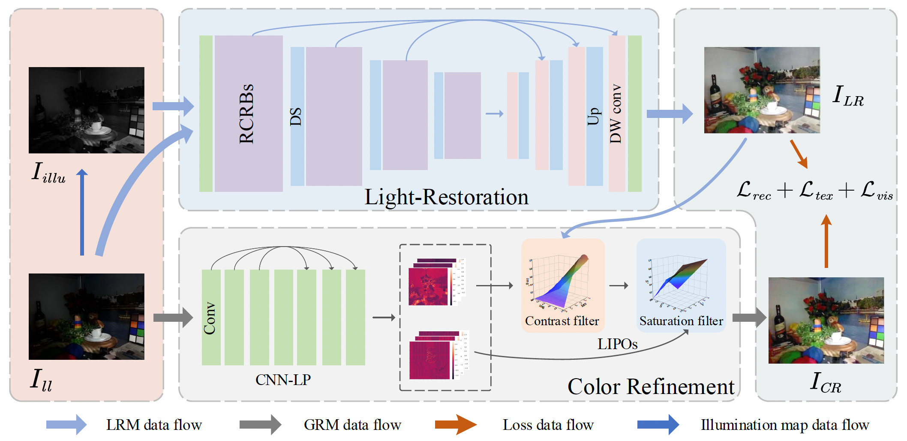
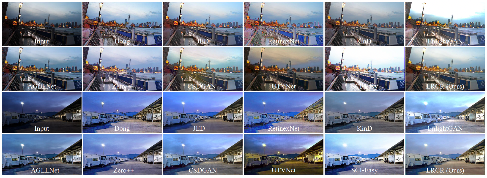
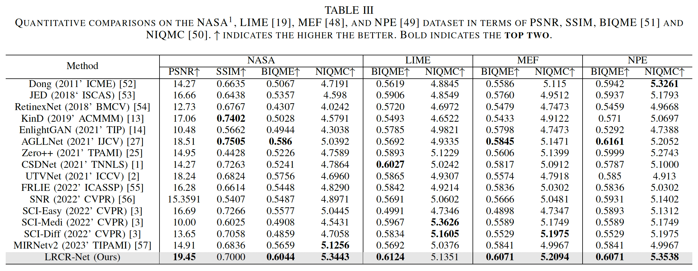

# <p align=center> :fire: `Coarse-to-Fine Low-light Image Enhancement with Light Restoration and Color Refinement`</p>

 

This is the official PyTorch codes for the paper.  
>**Coarse-to-Fine Low-light Image Enhancement with Light Restoration and Color Refinement**<br>  [Xu Wu](https://csxuwu.github.io/), Zhihui Lai<sup>*</sup>, Shiqi Yu, Zhuoqian Liang, Linlin Shen （ * indicates corresponding author)<br>
>IEEE Transactions on Emerging Topics in Computational Intelligence (TETCI), 2023





### :rocket: Highlights:
- A novel framework called LRCR-Net, whose most notable property is its progressive coarse-to-fine paradigm, is proposed for low-light image enhancement. With this advanced paradigm that overcomes the crucial challenges, LRCR-Net can achieve proper light restoration and visual pleasing color.
- In the coarse step, the RCRB is designed to fully explore and exploit low-light region features from both local and global perspectives. Moreover, the LIPOs are introduced in the fine step to refine the color output of the coarse step, thereby further improving the performance of the LRCR-Net.
- The effectiveness of LRCR-Net has been validated on various low-light enhancement benchmarks. These results demonstrate the superiority of our LRCR-Net over other state-of-the-art techniques.


## Examples:
### NASA


### LIME


### NPE


### Quantitative comparisons


## Dependencies and Installation

- Ubuntu >= 18.04
- CUDA >= 11.0
- Other required packages in `requirements.txt`


### Test LRCR
pass

### Train LRCR
pass

## Citation
If you find our repo useful for your research, please cite us:
```
@inproceedings{wu2023ridcp,
    title={Coarse-to-Fine Low-light Image Enhancement with Light Restoration and Color Refinement},
    author={Xu Wu, Zhihui Lai, Shiqi Yu, Jie Zhou, Zhuoqian Liang, Linlin Shen},
    booktitle={IEEE Transactions on Emerging Topics in Computational Intelligence},
    year={2023}
}
```

## License
Licensed under a [Creative Commons Attribution-NonCommercial 4.0 International](https://creativecommons.org/licenses/by-nc/4.0/) for Non-commercial use only.
Any commercial use should get formal permission first.

## Acknowledgement
This repository is maintained by [Xu Wu](https://csxuwu.github.io/).
